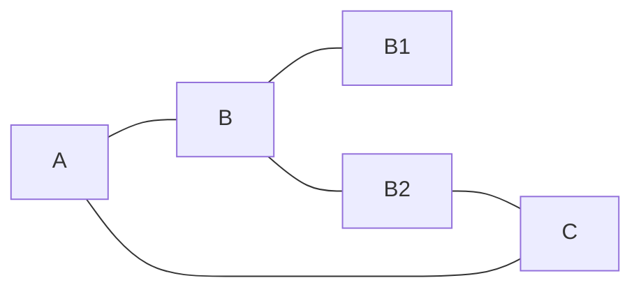

# T1
> HTML 代码 HTML codes

```html
<!DOCTYPE html>
<html>
    <head>
        <mate charest="utf-8" />
        <meta name="keywords" content="Editor.md, Markdown, Editor" />
        <title>Hello world!</title>
        <style type="text/css">
            body{font-size:14px;color:#444;font-family: "Microsoft Yahei", Tahoma, "Hiragino Sans GB", Arial;background:#fff;}
            ul{list-style: none;}
            img{border:none;vertical-align: middle;}
        </style>
    </head>
    <body>
        <h1 class="text-xxl">Hello world!</h1>
        <p class="text-green">Plain text</p>
    </body>
</html>
```
# T2
## T2.1哈哈哈



